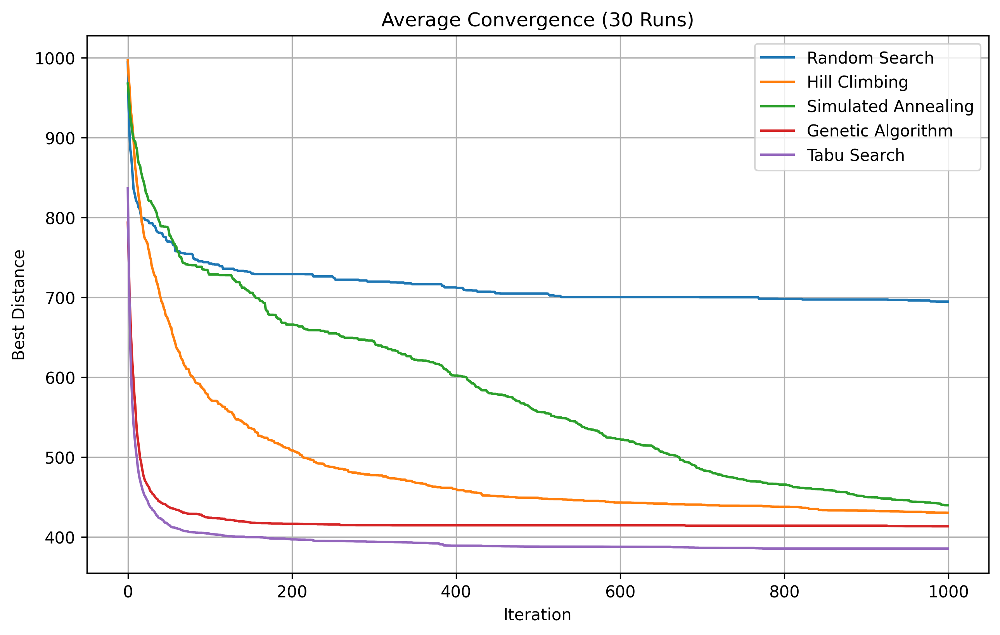
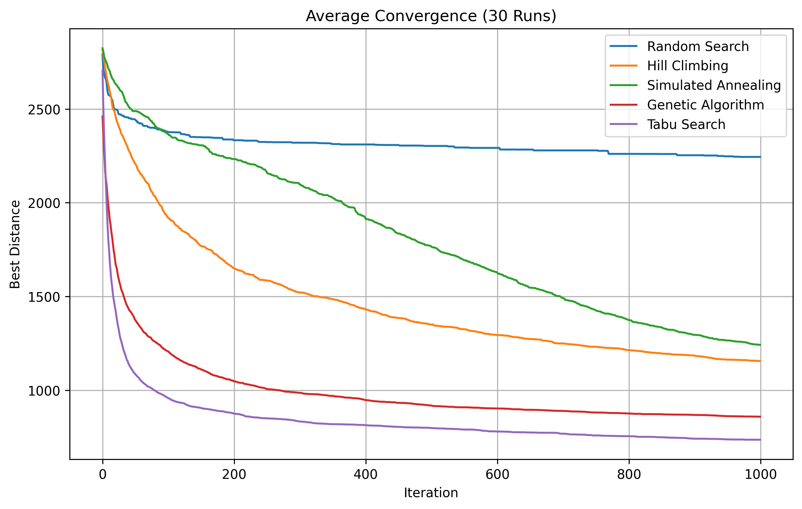
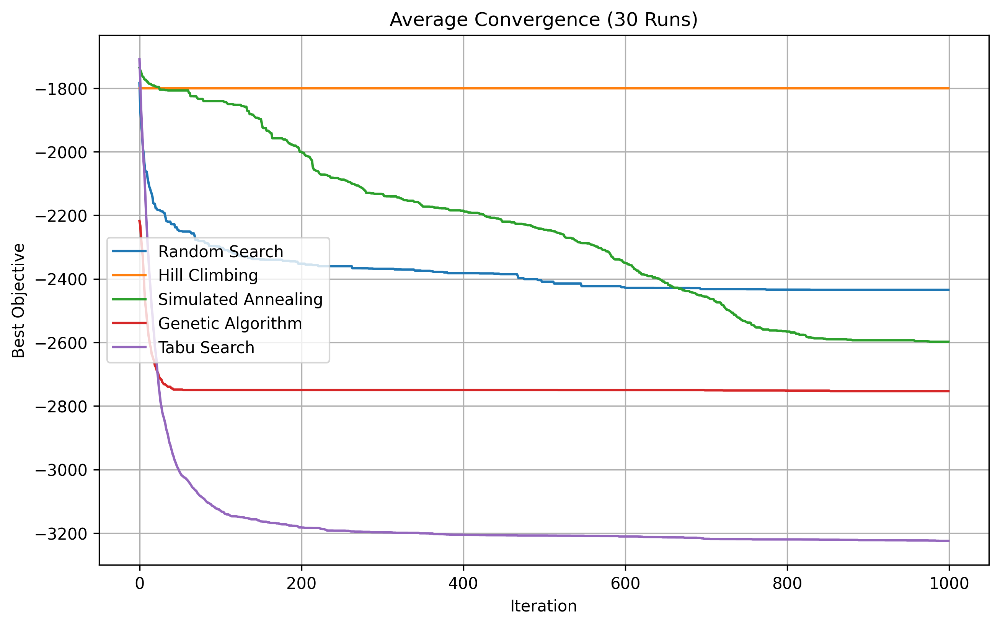

# O-Bench

**O-Bench** is a modular, research-oriented framework for benchmarking and analyzing metaheuristic optimization algorithms on NP-hard combinatorial optimization problems. It provides a unified environment for evaluating algorithmic performance, convergence dynamics, runtime efficiency, robustness, and scalability across multiple problem domains.

---

## Algorithms Implemented

| Algorithm | Type | Key Characteristic |
|---|---|---|
| Random Search | Baseline | No memory, pure exploration |
| Hill Climbing | Local Search | Greedy, exploits neighborhood |
| Simulated Annealing | Local Search | Probabilistic escape from local optima |
| Genetic Algorithm | Population-based | Crossover-driven structural search |
| Tabu Search | Local Search | Memory-based neighborhood avoidance |

---

## Problem Domains

### Traveling Salesman Problem (TSP)
Find the shortest route visiting all cities exactly once and returning to the start. Cities are randomly generated on a 100×100 grid.

- **Representation:** Permutation of city labels
- **Neighbor:** Random 2-city swap
- **Evaluation:** Total Euclidean tour distance

### 0/1 Knapsack Problem
Maximize total value of selected items without exceeding a weight capacity.

- **Representation:** Binary vector (include/exclude per item)
- **Neighbor:** Single bit-flip
- **Evaluation:** Negative total value (penalty applied for overweight solutions)
- **Capacity:** 30% of total item weight

---

## Results

### TSP - 20 Cities



| Algorithm | Best | Mean | Std | Avg Runtime |
|---|---|---|---|---|
| Random Search | 632.93 | 715.22 | 40.21 | 0.0047s |
| Hill Climbing | 356.61 | 437.15 | 49.27 | 0.0036s |
| Simulated Annealing | 365.22 | 430.31 | 39.03 | 0.0051s |
| Genetic Algorithm | 361.00 | 388.94 | 27.85 | 1.2400s |
| Tabu Search | 356.61 | 363.50 | 12.23 | 0.1992s |

### TSP - 50 Cities



| Algorithm | Best | Mean | Std | Avg Runtime |
|---|---|---|---|---|
| Random Search | 1941.62 | 2244.34 | 101.30 | 0.0120s |
| Hill Climbing | 965.32 | 1155.85 | 83.05 | 0.0076s |
| Simulated Annealing | 1081.93 | 1242.11 | 94.87 | 0.0108s |
| Genetic Algorithm | 750.36 | 858.87 | 64.86 | 3.3073s |
| Tabu Search | 661.68 | 735.97 | 48.24 | 0.4088s |

### Knapsack - 100 Items


> Scores are negative because the framework minimizes by convention, more negative = higher value selected.



| Algorithm | Best Value | Mean Value | Std | Avg Runtime |
|---|---|---|---|---|
| Random Search | 2603 | 2434.77 | 72.14 | 0.0126s |
| Hill Climbing | 2144 | 1800.47 | 205.43 | 0.0046s |
| Simulated Annealing | 2912 | 2598.03 | 196.45 | 0.0071s |
| Genetic Algorithm | 2999 | 2753.20 | 148.07 | 1.0299s |
| Tabu Search | 3309 | 3224.43 | 51.05 | 0.2400s |

> Random Search mean excluded, high variance from penalty-inflated scores on overweight solutions indicates RS rarely finds feasible solutions consistently at this capacity setting.

---

## Key Findings

### TSP
- **Tabu Search** achieves the best solution quality and lowest std dev at both 20 and 50 cities, outperforming even GA on consistency.
- **Genetic Algorithm** produces competitive quality but runs ~250× slower than single-solution methods at small scales.
- **Simulated Annealing** requires an iteration budget proportional to problem size. With a fixed 1000-iteration budget it underperforms Hill Climbing at 50 cities despite theoretical superiority, a direct consequence of insufficient exploration time post-escape.
- **SA cooling schedule** was made adaptive: initial temperature is estimated by sampling random neighbor deltas to target ~80% acceptance early on; cooling rate is computed so temperature reaches `T=1.0` by the final iteration.
- **Random Search** degrades sharply with scale, gap vs best algorithm grows from ~2× at 20 cities to ~3× at 50 cities.

### Knapsack
- **Tabu Search** dominates with a mean value of 2996.90 and std of just 35.85, nearly optimal and highly consistent across all 30 runs.
- **Simulated Annealing** outperforms Genetic Algorithm on both best and mean value at this scale, reversing the TSP ranking, the binary search space suits SA's bit-flip neighborhood well.
- **Random Search** fails to find reliably feasible solutions at 30% capacity, producing erratic scores due to frequent capacity violations.

---

## Project Structure

```
O-Bench/
│
├── algorithms/
│   ├── __init__.py
│   ├── random_search.py
│   ├── hill_climbing.py
│   ├── simulated_annealing.py
│   ├── genetic_algorithm.py
│   └── tabu_search.py
│
├── problems/
│   ├── tsp.py
│   └── knapsack.py
│
├── visualizations/
│   └── plotter.py
│
├── results/
│   ├── tsp_20cities/
│   └── knapsack_100items/
│
├── benchmark.py
└── avg_history.py
```

---

## How to Run

**Install dependencies:**
```bash
pip install matplotlib pandas numpy
```

**Run TSP benchmark:**
```bash
python -m problems.tsp
# Enter number of cities when prompted (e.g. 20, 50, 100)
```

**Run Knapsack benchmark:**
```bash
python -m problems.knapsack
```

Results (convergence plot + CSV) are saved automatically to `results/`.

---

## Design Philosophy

Every algorithm implements a common interface via the problem class:

```python
problem.random_solution()   # generate initial solution
problem.evaluate(solution)  # return scalar score (lower = better)
problem.neighbor(solution)  # return perturbed solution
problem.crossover(p1, p2)   # combine two solutions (GA)
```

This makes adding new algorithms or problem domains straightforward, no changes to existing code required.

---

## Experimental Setup

- **Trials:** 30 independent runs per algorithm per problem instance
- **Convergence curves:** Averaged across all 30 trials
- **Statistics reported:** Best, Mean, Std Dev, Average Runtime per trial
- **TSP cities:** Randomly generated on a 100×100 integer grid
- **Knapsack:** 100 items, weights ∈ [1, 50], values ∈ [10, 100], capacity = 30% of total weight

---

## Future Work

Planned additions include:

- Particle Swarm Optimization (PSO)
- Ant Colony Optimization (ACO)
- Differential Evolution
- Multi-objective optimization benchmarks
- Statistical significance testing
- Parallel execution support
- Additional NP-hard problems
